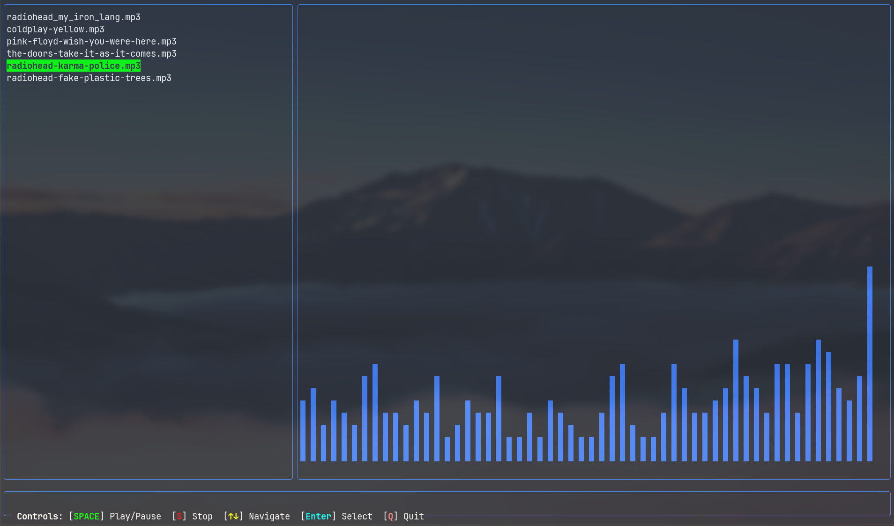

# Fado - Terminal MP3 Player

A lightweight terminal-based MP3 player written in Zig with modern TUI interface. Fado provides a simple yet elegant interface for playing MP3 files directly from your terminal.



## Features

- Modern TUI using Vaxis library
- Real-time audio visualization
- File browser interface
- Stereo audio playback
- Automatic sample rate detection
- Low memory footprint
- Simple keyboard controls

## Requirements

- Zig 0.13.0 or later
- PortAudio v19
- pkg-config
- C compiler (for linking)

### On Nix/NixOS:
```bash
nix develop
```

### On Ubuntu/Debian:
```bash
sudo apt install zig portaudio19-dev pkg-config build-essential
```

### On Fedora:
```bash
sudo dnf install zig portaudio-devel pkgconfig gcc
```

### On Arch Linux:
```bash
sudo pacman -S zig portaudio pkg-config base-devel
```

## Building

Clone the repository:
```bash
git clone https://github.com/2pipopolam/fado.git
cd fado
```

Build the project:
```bash
zig build
```

## Usage

Run Fado from the directory containing your MP3 files:
```bash
zig build run
```

Or after building:
```bash
./zig-out/bin/fado
```

### Controls

- `SPACE` - Play/Pause
- `S` - Stop
- `↑↓` - Navigate through files
- `Enter` - Select and play file
- `Q` - Quit

## Built With

- [Zig](https://ziglang.org/) - System programming language
- [PortAudio](http://www.portaudio.com/) - Audio I/O library
- [Vaxis](https://github.com/nullenv/vaxis) - Terminal UI library
- [minimp3](https://github.com/lieff/minimp3) - MP3 decoder

## License

This project is licensed under the MIT License - see the LICENSE file for details.
